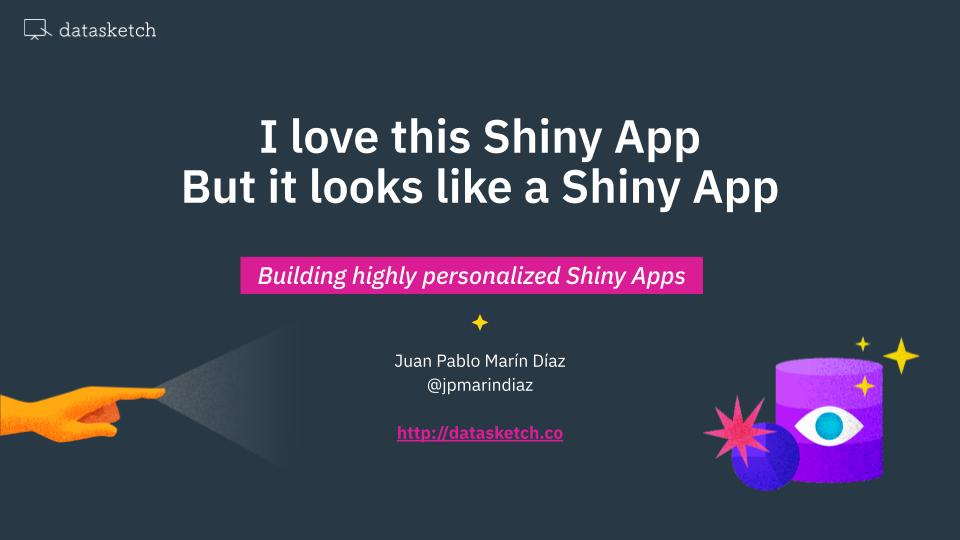

# RLadies STL - Building Highly Personalized Shiny Apps

_2021-01-19_

This repository contains the code for the workshop for [RLadies St Louis Meetup](https://www.meetup.com/rladies-st-louis/events/275416262/) on building highly personalized shiny apps.

No more: "I built a shiny app but it looks like a Shiny App"

## Slides

Click [here](https://docs.google.com/presentation/d/1fEBPwROahaVgegkJvcbH2ET7ssn1YHVtVkpENFVuNqo/edit#slide=id.g8df399507e_0_0) to access the slides

